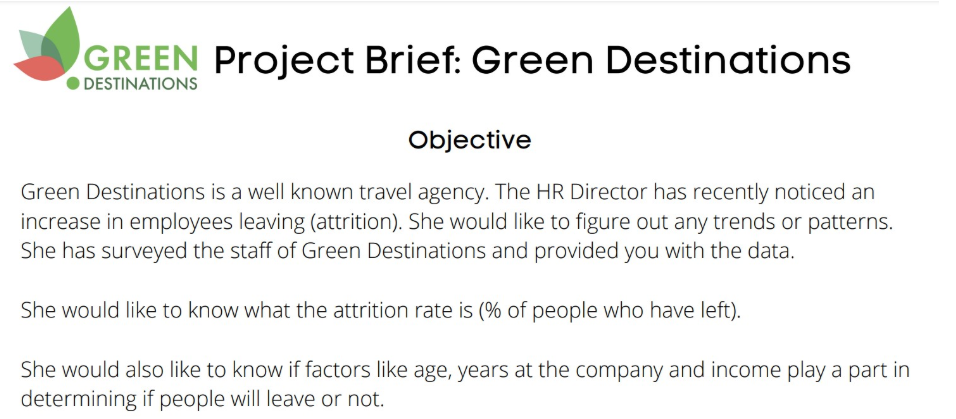
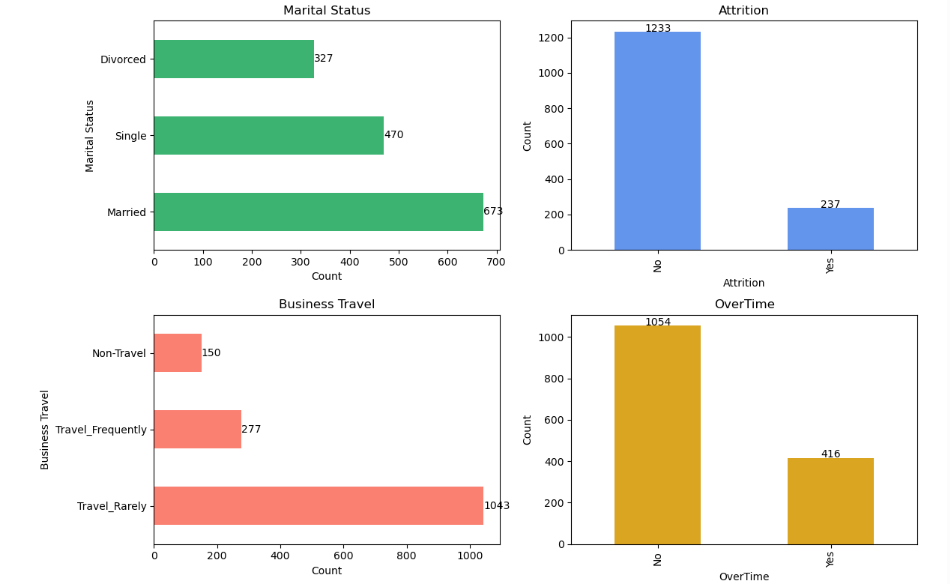
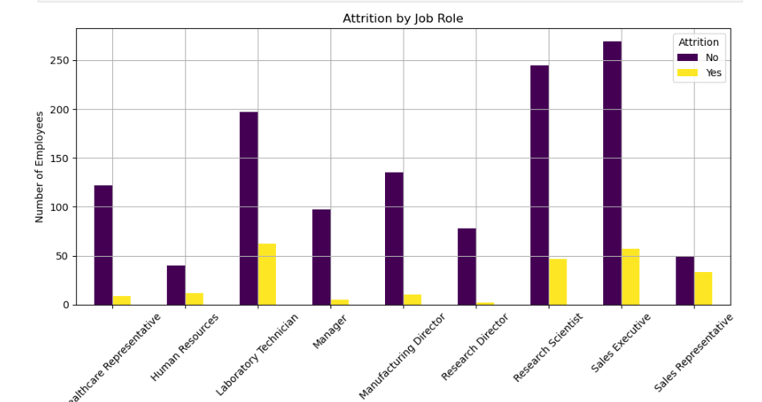
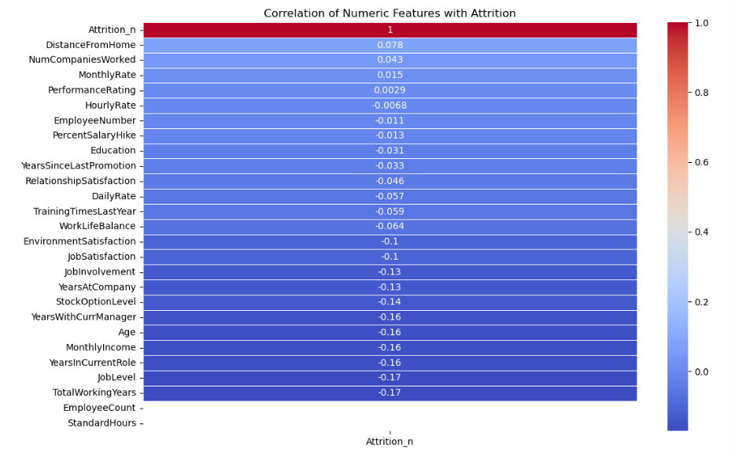
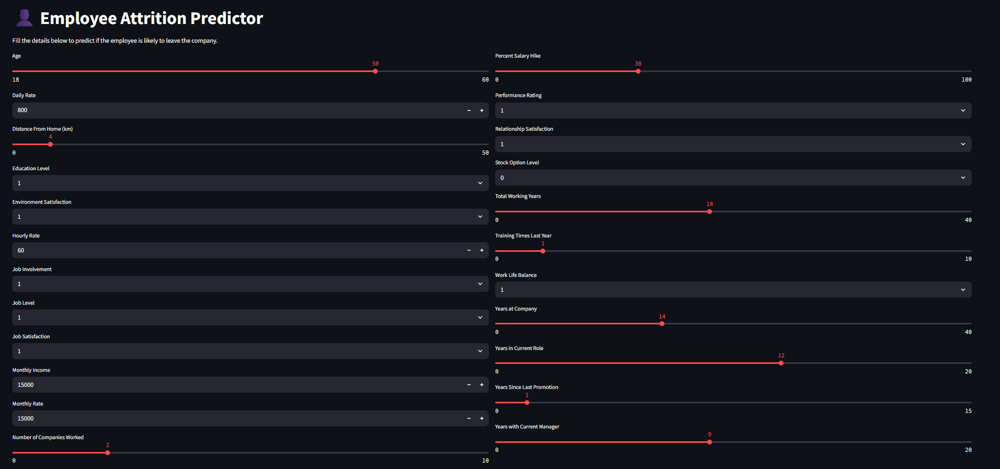
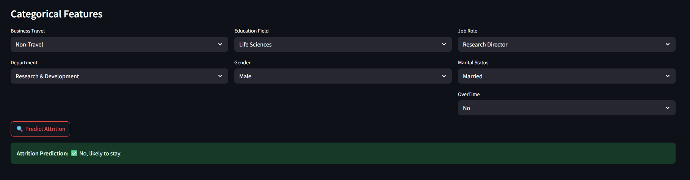
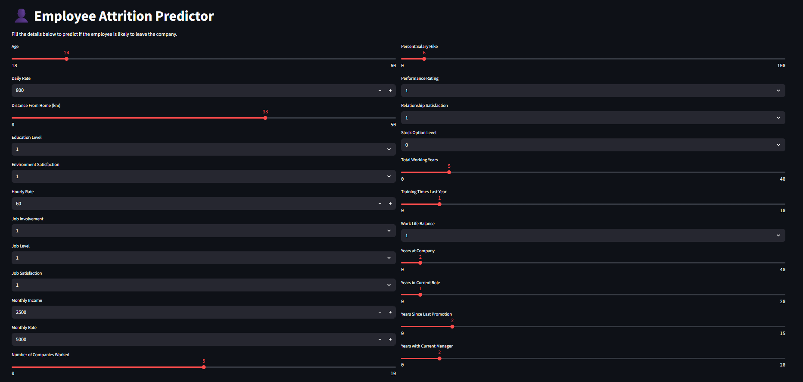
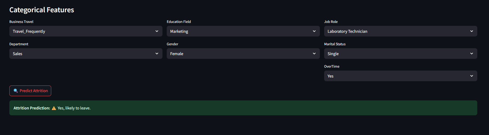

# Green Destination Employee Attrition Prediction




This project predicts whether an employee is likely to leave an organization using machine learning. Built with XGBoost and deployed via a user-friendly Streamlit app.

---

## Table of Contents

- [Overview](#overview)
- [Features](#features)
- [Installation](#installation)
- [Running the App](#running-the-app)
- [Input Parameters](#input-parameters)
- [Model Details](#model-details)
- [Sample Results](#sample-results)
- [Project Structure](#project-structure)

---

## Overview

Employee attrition has significant financial and cultural impacts on organizations. This tool enables HR teams to make proactive retention decisions by predicting the likelihood of attrition based on various features.

---

## Features

- Interactive form via Streamlit UI  
- One-hot encoding for categorical inputs  
- Predictive model trained using XGBoost  
- Real-time prediction: Likely to stay / Likely to leave  
- One-column and Two-column responsive layout for compact form  

---

## Installation

1. **Clone the repository**
   ```bash
   git clone https://github.com/UmerSalimKhan/Green-Destination-Employee-Attrition.git
   cd Green-Destination-Employee-Attrition
   ```

2. **Create a virtual environment**

   ```bash
   python -m venv venv
   venv\Scripts\activate  # On Windows - Activate 
   deactivate  # On Windows - Deactivate 
   ```

3. **Install dependencies**

   ```bash
   pip install -r requirements.txt
   ```

---

## Running the App

```bash
streamlit run app_col.py
Or 
streamlit run app.py
```

---

## Input Parameters

You’ll be asked to input:

* **Numerical:** Age, DailyRate, MonthlyIncome, etc.
* **Categorical:** Job Role, Business Travel, Education Field, Gender, etc.
* Handled using dropdowns, sliders, and number inputs.

---

## Model Details

* **Model**: XGBoost Classifier
* **Hyperparameter Tuning**: GridSearchCV
* **Metrics Achieved**:

  * Precision: \~0.89 for class 0
  * Recall: \~0.86 for class 0
  * F1-score: \~0.81 (weighted avg)
* **Train/Test Split**: 80/20
* **Model File**: `attrition_model.pkl`

---

## Project Structure

```
.
├── app.py / app_col.py         # Streamlit application
├── attrition_model.pkl         # Trained XGBoost model
├── requirements.txt            # Python dependencies
├── *.ipynb                     # Jupyter notebooks for analysis and ML
├── ....                        # And more files and folder
└── README.md                   # Project documentation
```

---

## Sample Results 

1. **Data Analysis:** _This projectcs contains multiple useful plots with impression on them. For all graphs, refer Green Destination Attrition Analysis.ipynb_

a. Distribution analysis of few columns


b. Attrition by Department


c. Correlation of features with target



2. **Machine Learning - StreamLit:** _This project contains a front-end using StreamLit._

a. Employee Retention



b. Employee Attrition




---

## 🙋‍♂️ Author

**Umer Salim Khan**
[GitHub](https://github.com/UmerSalimKhan)
